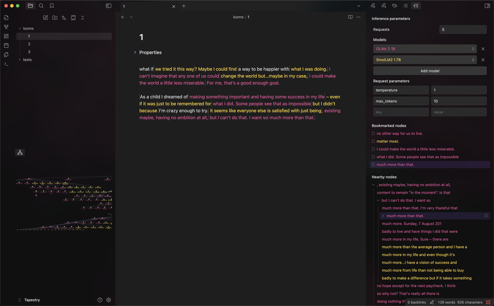
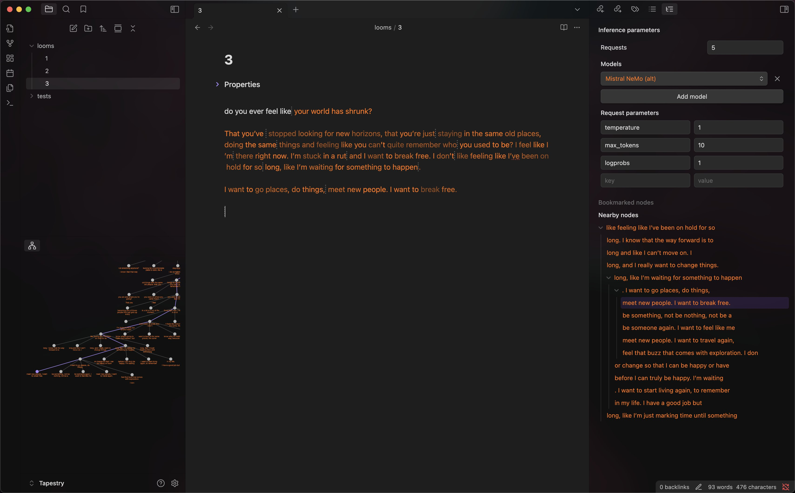
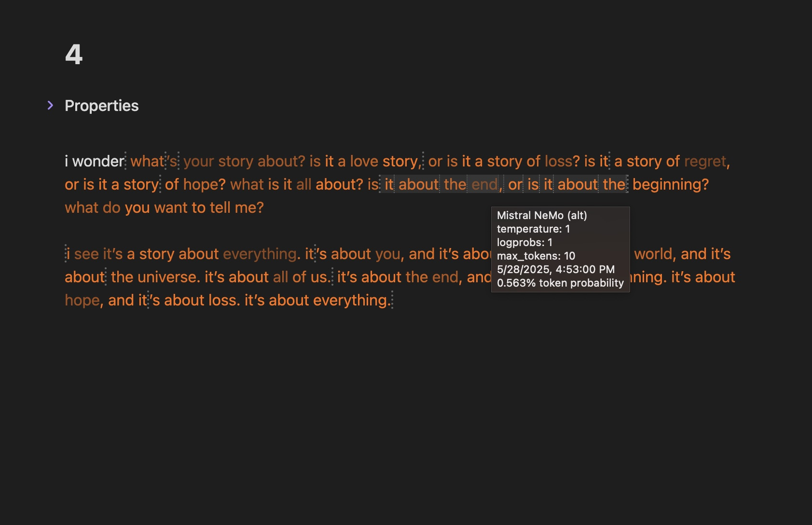
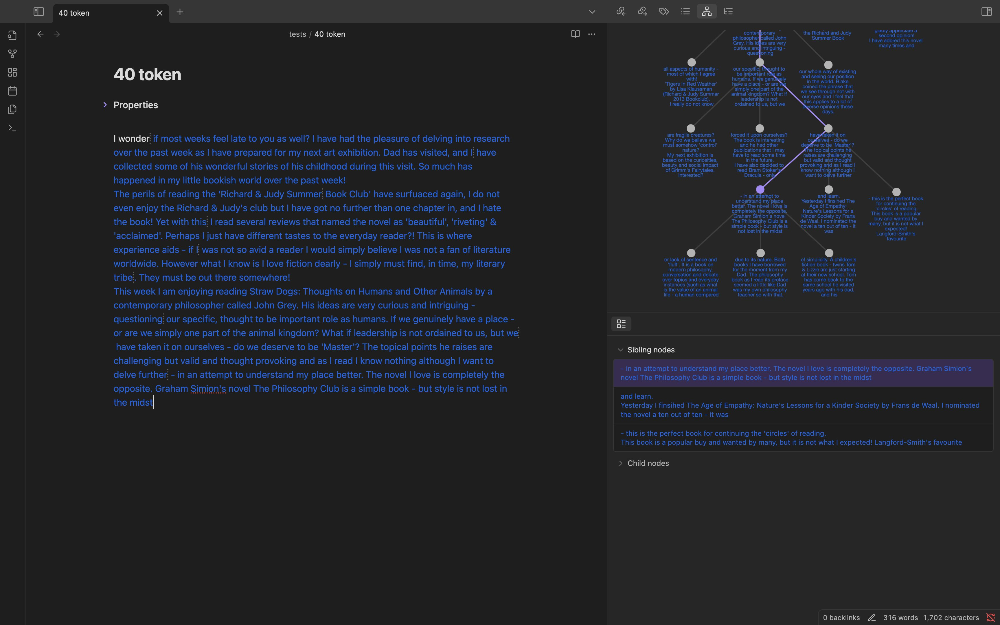

# Tapestry Loom

An Obsidian plugin that aims to turn your editor into an IDE for working with base model LLMs.

> [!NOTE]
> This plugin is a work in progress, and may contain bugs and missing/broken functionality.

## Included features

- Tree-based completion management
	- Nodes include metadata about the model and inference parameters used, along with a timestamp
	- Nodes include token probabilities when available
	- Prevents accidental deletion of generated nodes & preserves the context used to generate nodes
	- Support for bookmarking, splitting, and merging nodes
	- Completion tree storage within document
- List-based tree view, similar to [loomsidian](https://github.com/cosmicoptima/loom)
- Graph-based tree view, similar to [exoloom](https://exoloom.io)
- List-based node view, similar to [loomsidian](https://github.com/cosmicoptima/loom) and [exoloom](https://exoloom.io)
- Editor overlay view, similar to [loomsidian](https://github.com/cosmicoptima/loom)
	- Token probability display in editor, similar to [loom](https://github.com/socketteer/loom)
- Automatic creation of single-token probability nodes, similar to [logitloom](https://github.com/vgel/logitloom)
- Recursive completion generation, similar to [loom](https://github.com/socketteer/loom) and [logitloom](https://github.com/vgel/logitloom)
- Color coding by model used (requires a model color to be configured)
- Node metadata display on hover (currently only in list and editor), similar to [exoloom](https://exoloom.io)
- Flexible LLM API client
	- Support for completions with multiple different models at a time
	- Support for custom JSON/headers, similar to [loomsidian](https://github.com/cosmicoptima/loom)

Screenshots

### Possible future features

- Document revision functionality / diff management
- Templating / importing context from other documents
- Improve weave flexibility (in next major version):
	- Option 1: Store content diffs inside of nodes rather than raw text using [diff-match-patch](https://github.com/google/diff-match-patch), similar to [minihf's loom](https://github.com/JD-P/minihf)
	- Option 2: Store nodes in a DAG to allow for middle-of-text completions, similar to this [unreleased loom implementation](https://www.youtube.com/watch?v=xDPKR271jas&list=PLFoZLLI8ZnHCaSyopkws_9344avJQ_VEQ&index=19)
		- Despite being more complex to implement, this is the approach I personally prefer.
- Improve weave storage (in next major version):
	- Store weave in sidecar file by default, only store in document frontmatter if the user explicitly requests to do so
	- Improve weave format; Implement efficient weave loading and saving
		- Implement binary nodes to improve handling of invalid unicode
	- Allow graceful handling of editor undo/redo functionality
- Generation presets
- Prompt logprobs support
- Implement lazy weave storage updating to improve performance
- Support for additional endpoint types (especially if they allow implementing additional features)
- Document analysis tools
- Interactive sampling parameter visualizations
- Built in user manual, based on my [notes about loom](https://gist.github.com/transkatgirl/9d04c9d05e041f062bcb31ed5fd915e1) and the [cyborgism wiki](https://cyborgism.wiki)

I'm likely not going to be able to work on these features very soon, but I'm happy to review any pull requests if you would like to try implementing these features yourself.

## Usage

> [!WARNING]
> This plugin relies on Obsidian's internal styling rules, and will likely have a broken interface on earlier or later versions than what it was built for. At the moment, this plugin is targeting Obsidian **1.8.x**, and was last tested on Obsidian **1.8.10**.

### Installation

> [!IMPORTANT]
> It is recommended that you create a dedicated Obsidian vault for this plugin.

1. Make sure community plugins are enabled within Obsidian.
2. Clone this git repository into your vault's `.obsidian/plugins/` folder.
3. Open a terminal in the plugin folder.
4. Run `npm install && npm run build` to fetch dependencies and build the plugin.
5. Open Obsidian's plugin settings and enable the plugin.

#### Updating

1. Open a terminal in the plugin folder.
2. Pull recent commits to the repository using `git pull`.
3. Run `npm install && npm run build` to fetch dependencies and build the plugin.
4. Open Obsidian's plugin settings and disable the plugin, then re-enable it.

### Post-install

After installing and enabling the plugin, you will need to do some post-install tasks to get the most out of it:

- Add your LLM model endpoints in the Tapestry Loom settings.
	- Unlike other LLM clients, the endpoint *must* be specified by the full URL rather than just the API prefix.
	- If you plan on using multiple models at a time, adding color labels to your models is recommended.
		- As a starting point, consider looking at [brand colors for popular models](./model%20colors.md)
- Open Obsidian's hotkey settings, and add hotkeys for frequently used Tapestry Loom commands.
	- It is strongly recommended that you at least add hotkeys for moving between nodes, splitting nodes, and generating completions.
- Find inference parameters you like, and then set them as your new defaults in the Tapestry Loom settings.